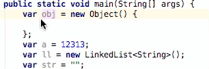

# Java 10 Var Type Hint 
# Pending ……

# Usage
Press `Ctrl -` (or `Command -` on Mac) on a line or reopen a Java 10 file.

# Notes:
- `Anonymous object` has its folding so that you can move the cursor the between the `identifier` and `=` symbol (just like the screenshot)
- In other cases, press the key everywhere for a line is OK. 
	  
# ScreenShot
